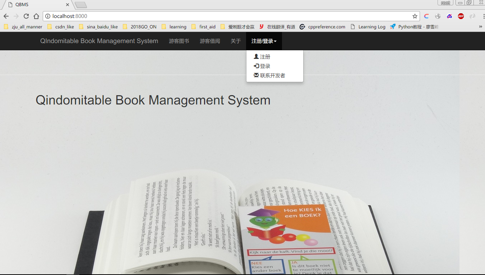
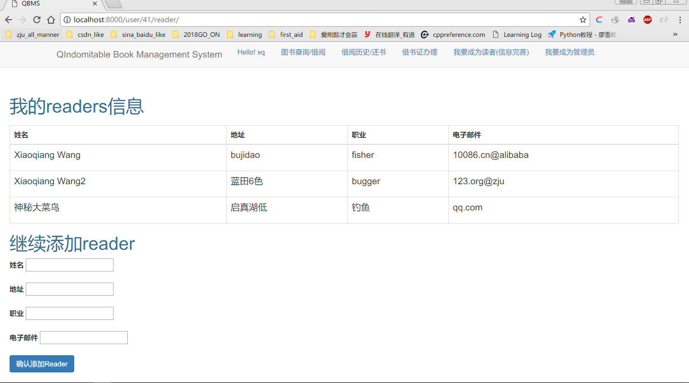
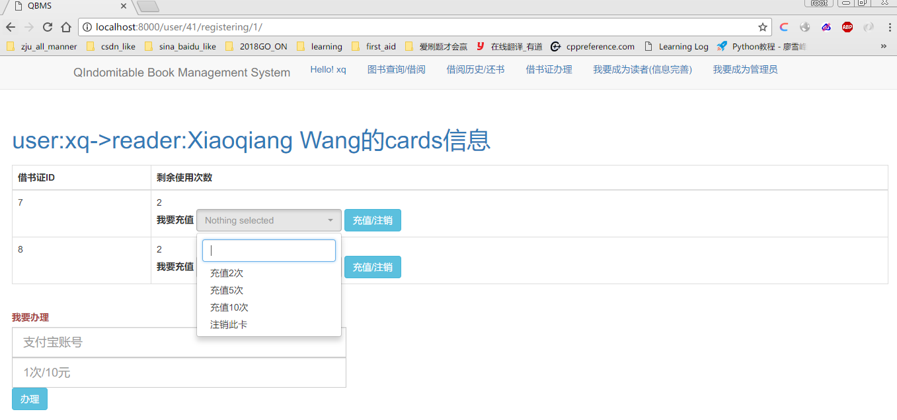
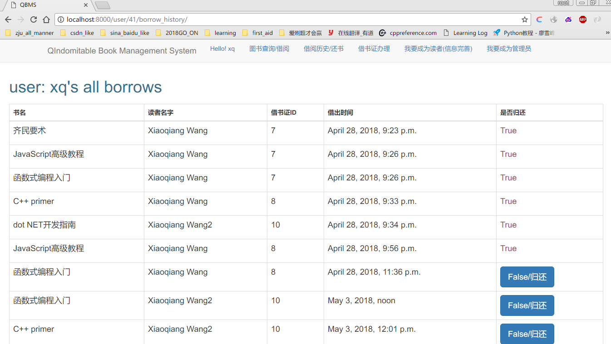
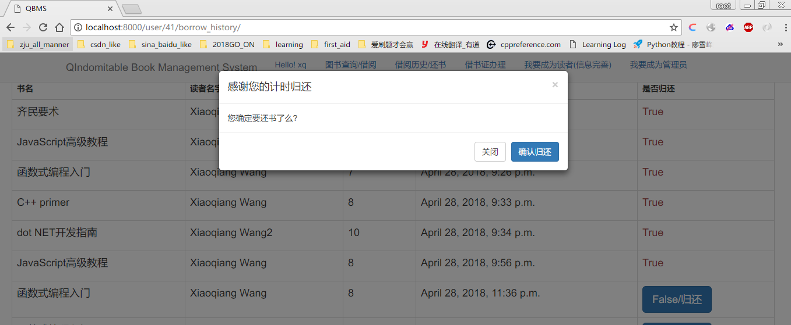

# QIndomitable-Book-Management-System(QBMS) 

- QBMS is our Database System curriculum B/S project based Python and HTML
- Implemented by [Xiaoqiang Wang](https://robert-xiaoqiang.github.io/)

## Features
- Sign up(Register) and Sign in
- Query by contitions about author name, book name, publisher and so on
- Borrow book
- Apply for a library card and recharge for it
- Return the book

## Build
#### Dependence & Reference
- DBMS: MySQL5.7
- Back-end Script: Python3.4
   - Web Framework: Django1.8.5
- Front-end Framework: Bootstrap3

#### Main
- $ Python manage.py runserver

#### Deployment
- TO-DO

#### Screenshots
- **User sign up and sign in**

---
- **Add a reader and rechagre**

---
- **Query and borrow**

---
- **Return**

---

